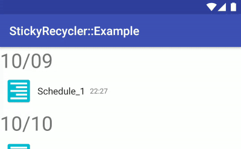

# android-sticky-recycler

An example project / library of sticky recyclerview.



This is contains below components:

- StickyRecyclerAdapter
- StaticLinearLayoutManager
- StickyVerticalLayoutManager
- MultiCheckableStickyAdapter

Example app is available on Google Play Store:

<a href='https://play.google.com/store/apps/details?id=jp.s64.android.stickyrecycler.example&pcampaignid=MKT-Other-global-all-co-prtnr-py-PartBadge-Mar2515-1'></a>

`:example` is wrote w/ **Kotlin**, **Android Architecture Components** (Lifecycle Components), **Dagger2**. Check it out. ;)

## Usages

Add following lines to your buildscripts.

```groovy
buildscript {
    ext {
        sticky_recycler_version = '0.0.4'
    }
}
```

```groovy
repositories {
    maven { url 'http://dl.bintray.com/s64/maven' }
}

dependencies {
    compile "jp.s64.android.stickyrecycler:core:${sticky_recycler_version}"
    // compile "jp.s64.android.stickyrecycler:rbe:${sticky_recycler_version}"
}
```

## Donate

<a href="https://donorbox.org/android-sticky-recycler"></a>

<a href="https://www.patreon.com/S64"></a>

## License

```
Copyright 2017 Shuma Yoshioka

Licensed under the Apache License, Version 2.0 (the "License");
you may not use this file except in compliance with the License.
You may obtain a copy of the License at

   http://www.apache.org/licenses/LICENSE-2.0

Unless required by applicable law or agreed to in writing, software
distributed under the License is distributed on an "AS IS" BASIS,
WITHOUT WARRANTIES OR CONDITIONS OF ANY KIND, either express or implied.
See the License for the specific language governing permissions and
limitations under the License.
```
